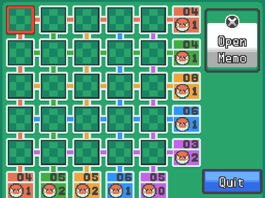
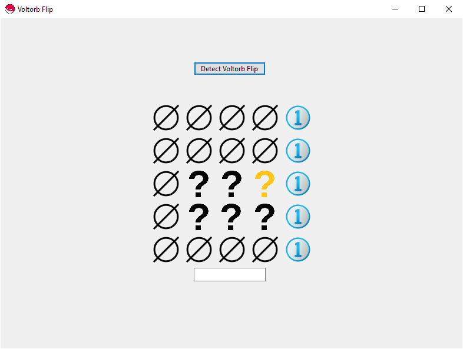
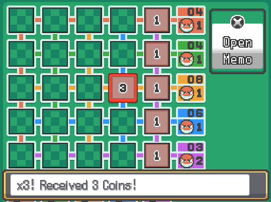
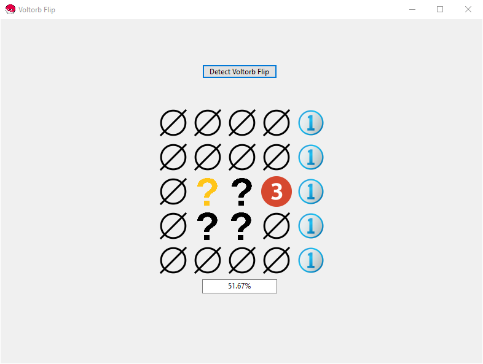
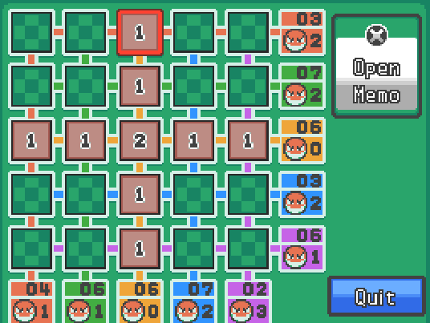
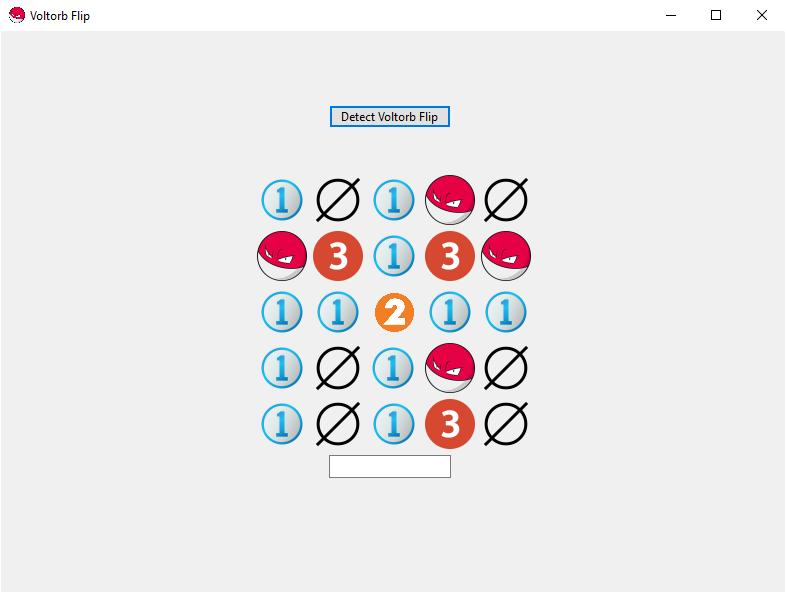

# Voltorb Flip

This is a Windows Form App to help deciding your best play when battling Mr. Game at a round of [Voltorb Flip](https://bulbapedia.bulbagarden.net/wiki/Voltorb_Flip). There is another solver out there, you can find it [here](http://voltorbflip.com/). This desktop application does not require you to input bounds, however, as these are parsed automatically.

## Introduction

For those that are not aware, Voltorb Flip is a luck-based game where cards are placed top-down in a 5x5 grid. Card can be either 1, 2, 3 or a Voltorb. Each row/column has a restriction both in terms of total value and number of Voltorbs it can contain.

The goal of the game is to flip over all 2's and 3's present in the grid. If you select a voltorb, you lose the current level. You drop down to a lower level if the amount of flipped cards is less than the current level number. Lower levels yield considerably fewer coins than higher ones.

## Finding a solution

The game is not easily solved, as the positions of Voltorbs cannot be predicted consistently based on the current state of the grid and the clues provided in the margins. There will always be some level of randomness influencing the game.

When asked to provide insight on a grid, the solver looks at _**all possible grids**_ that satisfy the constraints and do not conflict with any cards whose value is already known. The above blank grid does not contain that much direct information: the last column are all 1's. This does not influence our score though, so we are not that interested in that part of the analysis. You can also notice that some cards are flagged as **∅**, and some as **?**. Question marks could be either a 2/3 or a Voltorb and will have to be guessed if no other options are available. The empty set symbol ∅ indicated a 'useless' position in the grid. This means these can only contain a Voltorb or a 1, neither of which improve the score of the player. These positions should therefore never be guessed, as they provide no reward to counter the risk of guessing.

Each question mark also has a usefulness probability assigned, i.e. the fraction of solutions that had a 2 or a 3 at that position. This probability can be seen in the bottom textbox when hovering over the card. The highest probability of success is found at the golden question mark.

In this case the golden question mark was covering a 3.

## Other Examples

This grid layour does not seem to contain very much information at first glance. However, the solver can immediately reveal every card required to beat the level.